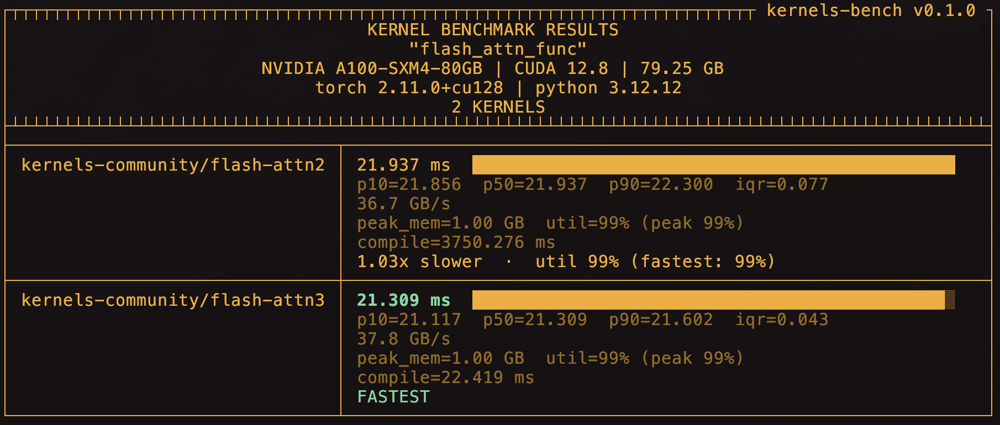

# kernels-bench

A benchmarking tool for [HuggingFace Kernels](https://huggingface.co/docs/kernels/index). Compare CUDA kernel performance on your hardware — from the CLI or as a Python library.

## Example

FlashAttention-2 vs FlashAttention-3 on an A100, from a single command — the right torch build is auto-resolved from each kernel's published variants, run remotely on HF Jobs, results streamed back and rendered locally (fastest in green):



```bash
kernels-bench quick \
  -k kernels-community/flash-attn2,kernels-community/flash-attn3 \
  --fn flash_attn_func \
  --arg q:4,8192,32,128:float16 \
  --arg k:4,8192,32,128:float16 \
  --arg v:4,8192,32,128:float16 \
  --remote a100-large
```

## Install

Requires Python 3.12+ and a CUDA GPU.

```bash
pip install git+https://github.com/dwarez/kernels_bench.git
```

Or for development:

```bash
git clone https://github.com/dwarez/kernels_bench.git
cd kernels_bench
uv sync
```

## Quick start

### Discover kernel functions

```bash
kernels-bench list kernels-community/activation
```

### Benchmark from the CLI (no code needed)

```bash
kernels-bench quick \
  -k kernels-community/activation \
  --fn gelu_fast \
  --arg y:1024,1024:float16:output \
  --arg x:1024,1024:float16:input \
  -w 10 -n 100
```

Arguments are passed to the kernel function in the order you specify them. The format is `name:shape:dtype:role` where dtype (default: `float16`) and role (default: `input`) are optional.

### Compare multiple kernels

```bash
kernels-bench quick \
  -k kernels-community/activation,another-org/activation \
  --fn gelu_fast \
  --arg y:1024,1024:float16:output \
  --arg x:1024,1024:float16:input \
  --validate \
  -n 100
```

The `--validate` flag runs each kernel once on the same input data and checks that outputs match across kernels (using `torch.allclose`). Tolerance is configurable with `--atol` and `--rtol`. Outputs are taken from any `:output` args you declare, or — for functional kernels like `flash_attn_func` that return their result — from the return value. If a kernel produces neither (e.g. it mutates an input in place), validation errors out rather than reporting a hollow pass over zero elements.

Each kernel id may be suffixed with `@revision` (a branch, tag, or commit SHA) — e.g. `-k org/act,org/act@dev` — to pin or compare specific revisions of the same repo, handy for catching regressions before publishing.

### Heavier workloads

Any kernel on the Hub works — here's Flash Attention 2 with sequence length 8k:

```bash
kernels-bench quick \
  -k kernels-community/flash-attn2 \
  --fn flash_attn_func \
  --arg q:4,8192,32,128:float16 \
  --arg k:4,8192,32,128:float16 \
  --arg v:4,8192,32,128:float16 \
  -w 10 -n 100
```

### Custom benchmarks with a bench file

For more control — parameter sweeps, custom logic, multiple steps — write a bench file:

```python
# bench_gelu.py
import torch
from kernels_bench import Bench, TensorSpec

bench = Bench(
    name="gelu_activation",
    inputs=[
        TensorSpec("x", shape=("M", "N"), dtype=torch.float16),
    ],
    outputs=[
        TensorSpec("y", shape=("M", "N"), dtype=torch.float16, role="output"),
    ],
    params={"M": [1024, 2048, 4096], "N": [1024]},
)

@bench.fn
def forward(kernel, x, y):
    kernel.gelu_fast(y, x)
```

Then run it:

```bash
kernels-bench run bench_gelu.py \
  -k kernels-community/activation \
  -w 10 -n 100
```

Symbolic dimensions (strings like `"M"`, `"N"` in the shape) are resolved from `params`, producing a benchmark for every combination.

### Use as a Python library

```python
from kernels_bench import Bench, TensorSpec, print_results

bench = Bench(
    name="my_benchmark",
    inputs=[TensorSpec("x", shape=(2048, 1024), dtype=torch.float16)],
    outputs=[TensorSpec("y", shape=(2048, 1024), dtype=torch.float16, role="output")],
)

@bench.fn
def forward(kernel, x, y):
    kernel.gelu_fast(y, x)

result = bench.run(
    kernels=["kernels-community/activation"],
    warmup=10,
    iterations=100,
    validate=True,  # check correctness when comparing multiple kernels
)

print_results(result)

# Access results programmatically
for kr in result.kernel_results:
    print(f"{kr.kernel_id}: {kr.median_ms:.3f} ms")

# Export to JSON
import json
json.dump(result.to_dict(), open("results.json", "w"), indent=2)
```

## Remote benchmarking (no local GPU required)

Want to know whether kernel A or B is faster on an H200 you don't have? Add
`--remote <flavor>` to `quick` or `run` and the benchmark executes on an
ephemeral [HuggingFace Jobs](https://huggingface.co/docs/huggingface_hub/guides/jobs)
GPU instead of locally. The results stream back and render exactly as a local
run — same table, same `-o` export.

```bash
kernels-bench quick \
  -k kernels-community/activation \
  --fn gelu_fast \
  --arg y:1024,1024:float16:output \
  --arg x:1024,1024:float16:input \
  --validate \
  --remote h200
```

```bash
kernels-bench run bench_gelu.py -k kernels-community/activation --remote a100-large
```

List the available GPU flavors:

```bash
kernels-bench hardware
```

Single-GPU options include `t4-small`, `l4x1`, `l40sx1`, `a10g-small`,
`a100-large`, and `h200` (the single-GPU Hopper card — HF Jobs has no `h100`).
Multi-GPU and larger variants (`a100x8`, `h200x4`, …) are listed too.

**Notes:**

- Requires a HuggingFace login (`hf auth login`) or `HF_TOKEN`. Your token is
  forwarded to the job so private kernels work.
- `--remote-timeout` (default `30m`) caps the job's duration — and therefore its
  cost. Use a cheap flavor like `t4-small` for a first smoke test.
- Remote runs execute the **published** version of kernels-bench from git, not
  your local working tree. To benchmark an unmerged branch, push it and set
  `KB_REMOTE_REF=<branch>`.
- `--profile` is local-only (the trace can't be streamed back).

## Output

Results are shown in a colorized box-drawing table (see the [example](#example) above) — timing with comparison bars, throughput, peak memory, and GPU utilization. The fastest kernel is highlighted green, regressions and noisy measurements red; each kernel is labeled by its full repo id (and `@revision` when comparing revisions).

When `--validate` is used, a validation section appears before the timing results showing PASS/FAIL for each kernel pair with max absolute/relative differences.

### Metrics

On CUDA, each run automatically collects:

- **`peak_mem`** — peak device memory allocated during the timed window (`torch.cuda.max_memory_allocated`).
- **`util`** — mean and peak GPU utilization (SM-busy %) sampled via NVML while the kernel runs. Reported only when the window is long enough to collect ≥3 samples.

When multiple kernels are compared, the slowdown line also shows the slower kernel's util next to the fastest's. That makes it easy to tell whether a slower kernel is *inefficient* (lower util) or just *doing more work* (similar/higher util than the fastest).

Pass `--no-metrics` to skip collection entirely — useful if you want zero overhead or are troubleshooting NVML.

Metrics for MPS backends are not yet collected; those fields stay `null` in the JSON export.

### How timing works

Reported times are **device time** measured with CUDA/MPS events, not wall-clock
time around the Python call. This matters: launching a kernel from Python costs
tens of microseconds, so for a kernel that runs in a few microseconds, wall-clock
timing measures the launch overhead, not the kernel — bandwidth/FLOP numbers can
read an order of magnitude too low. Each reported sample batches enough
back-to-back calls to amortize the fixed timer cost, then divides back out to a
per-call time.

Warmup runs until the GPU reaches steady-state (boost) clocks — a fixed call
count isn't enough, since a fast kernel can run thousands of times before the
clocks ramp. `--warmup` sets a *minimum* call count; warmup continues past it
until the clocks have settled. The first call is timed separately and reported as
`compile` (JIT/autotune cost).

> **Note:** numbers are *warm-cache*. Repeated back-to-back calls leave inputs in
> L2, so a small tensor that fits in cache can report bandwidth above what a
> cold DRAM read would achieve. This reflects tight-loop reuse; cold-cache
> (L2-flushed) measurement is a planned opt-in.

## JSON export

Add `-o results.json` to any command to save results:

```bash
kernels-bench quick \
  -k kernels-community/activation \
  --fn gelu_fast \
  --arg y:1024,1024:float16:output \
  --arg x:1024,1024:float16:input \
  -o results.json
```

The JSON includes device info, timing stats, raw per-iteration times, and validation results.

## CLI reference

```
kernels-bench list <kernel-id>              # list functions in a kernel
kernels-bench hardware                      # list GPU flavors for --remote
kernels-bench quick [options]               # benchmark without a bench file
kernels-bench run <bench-file> [options]    # benchmark with a bench file
```

### Common options

| Flag | Description |
|------|-------------|
| `-k, --kernels` | Comma-separated kernel repo IDs |
| `-w, --warmup` | Warmup iterations (default: 10) |
| `-n, --iterations` | Timed iterations (default: 100) |
| `-o, --output` | Save results to JSON file |
| `--validate` | Check output correctness across kernels |
| `--atol` | Absolute tolerance for validation (default: 1e-3) |
| `--rtol` | Relative tolerance for validation (default: 1e-3) |
| `--no-metrics` | Skip collecting peak memory and GPU utilization |
| `--remote` | Run on a HuggingFace Jobs GPU of this flavor (e.g. `h200`) |
| `--remote-timeout` | Max remote job duration (default: 30m) |
| `--remote-namespace` | Org/account the HF Job runs under (or `KB_JOB_NAMESPACE`) |

### `quick` specific options

| Flag | Description |
|------|-------------|
| `-f, --fn` | Kernel function name to benchmark |
| `-a, --arg` | Tensor arg: `name:shape:dtype:role` (repeatable) |

## Supported dtypes

`float16` / `fp16`, `bfloat16` / `bf16`, `float32` / `fp32`, `float8_e4m3fn`, `float8_e5m2`

## Development

```bash
uv sync                          # install deps
uv run pytest tests/ -v          # run tests
uv run ruff check src/           # lint
uv run ruff format src/          # format
uv run ty check src/             # type check
```

## Credits

The CLI output style matches that of [hf-mem](https://github.com/alvarobartt/hf-mem)

## License

MIT
